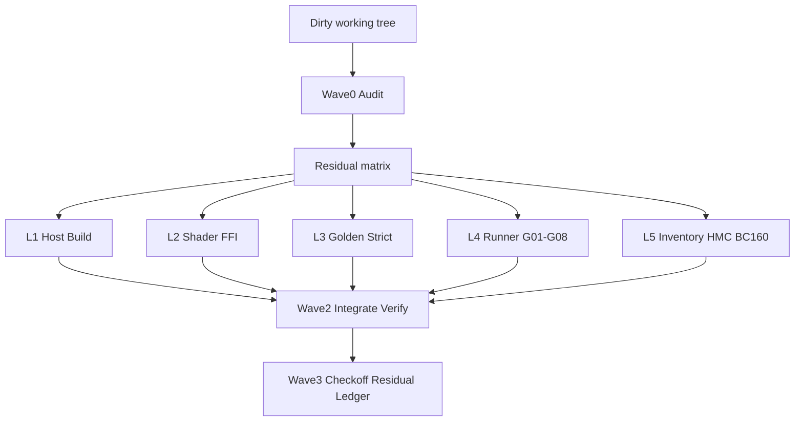

# Design: wgpu-host Productization Closeout (Evidence-First)

**Date:** 2026-08-20  
**Status:** Approved for implementation planning  
**Normative product plan:** `.omc/plans/wgpu-host-productization-consensus.md`  
**Approach:** Evidence-first residual matrix (Option C)

## 1. Problem

`revult` already has a 6-slice Linux Vulkan/wgpu host productization consensus plan, and a large dirty working tree that partially implements those slices (native shader composer, strict golden helpers, parent runner, gate inventory, BC-160 scripts, historical 7900XT archive). Consensus AC checkboxes are still unchecked; Ralplan still reports `consensus_complete: false`.

The remaining work is not a new product line. It is to **prove, keep, fix, or revert** existing WIP against the consensus ACs, then check off what is truly green and record honest residuals.

## 2. Goals

1. Audit the dirty tree against AC-1…AC-6.
2. Keep proven changes, fix yellow gaps, revert noise/false-green paths.
3. Check off only ACs with reproducible command evidence.
4. Publish an explicit residual ledger for anything not green.
5. Structure execution so work can be split across OMP agent types without shared-file thrash.

## 3. Non-Goals

- New product capabilities (Live2D core, packaging, Windows/macOS expansion, non-Vulkan backends).
- Big-bang deletion of the 134 Python gates.
- Treating ordinary CI green as release green.
- Expanding scope when a red cell fails twice — mark residual instead.
- Writing into recovered HuangmeiC or upstream SDL/GL reference trees.

## 4. Success Criteria

A closeout is complete when:

1. Every consensus AC is either:
   - **Green** and checked off with command evidence, or
   - **Residual** with reason, owner agent suggestion, and blocker relationship.
2. Dirty-tree noise has an owner decision: keep (intentional), fix, or revert.
3. No known false-green path remains in the claimed-green surface (implicit baseline write, prefix compare, stale binary standing in for source build).
4. AC-6 may remain residual if full `product_acceptance` / `release_acceptance` + single `evidence_revision` are not produced in this pass — residual must say so explicitly.

## 5. Constraints

| Constraint | Rule |
|---|---|
| Authority | Consensus plan ACs are the scoreboard; this design only defines closeout process |
| Zero SDL | Host remains `libSDL* = 0` |
| Fail-closed golden | Missing/mismatched baseline fails; never implicit baseline write on compare path |
| Single writer | Gate provisional ≠ final verdict; parent runner owns final envelope where applicable |
| AC checkoff writer | Only verifier-backed writer may flip consensus `- [ ]` → `- [x]` |
| Read-only assets | recovered HuangmeiC + upstream SDL/GL reference stay read-only |
| Hardware target | BC-160 is current performance authority; 7900XT is historical evidence only |

## 6. Residual Matrix (Core Mechanism)

### 6.1 Status vocabulary

| Status | Meaning | Action |
|---|---|---|
| Green | Reproducible command proof exists | Check off only; no code churn |
| Yellow | Directionally correct WIP; missing wiring/tests/evidence | Minimal patch + evidence |
| Red | Fails, false-green, or contradicts AC contract | Fix or revert |
| Noise | Unrelated to AC claim (actual dumps, accidental baseline drift, formatting churn) | Revert or quarantine out of authority tree |

### 6.2 Matrix schema

Artifact: `.omc/artifacts/productization-residual-matrix.md`

Each row:

- `ac_id` (AC-1…AC-6)
- `claim` (short AC sub-claim)
- `paths` (dirty or relevant paths)
- `status` (green/yellow/red/noise)
- `evidence_command`
- `evidence_summary` (exit code + key output)
- `decision` (keep/fix/revert/checkoff)
- `owner_agent`
- `notes`

### 6.3 Checkoff contract

- Scout builds the matrix (read-only).
- Executors may write provisional lane notes; they do **not** check ACs.
- Verifier re-runs AC commands on the integrated tree.
- Writer updates consensus checkboxes and residual ledger only from verifier results.

## 7. Architecture / Process Flow

```text
git dirty tree
  → Wave0 scout(+debugger): residual matrix
  → decisions: keep | fix | revert
  → Wave1 parallel lanes patch fix-rows only
  → Wave2 verifier re-runs AC command set
  → Wave3 writer: AC checkoffs + residual ledger (+ optional git-master commits)
```



## 8. OMP Agent Roster and Waves

### Wave 0 — Audit (read-only)

| Agent | Responsibility | Output |
|---|---|---|
| `scout` / `explore` | Map dirty paths → AC claims; propose keep/fix/revert | residual matrix |
| `debugger` (optional) | Root-cause red false-green / FFI / build failures without editing | cause notes on red rows |

### Wave 1 — Parallel fix lanes (only yellow/red)

| Lane | Agent | Primary touch set | Must not touch |
|---|---|---|---|
| L1 Host Build | `executor` | `host/renpy-host/src/main.rs`, warnings cleanup, `lib.rs`, `tests/`, `phase1_gates.sh`, Cargo manifests as needed | golden baselines; Python composer logic |
| L2 Shader/FFI | `executor` | `shader.rs`, `python.rs` FFI tuple, `state.rs` composer ownership, `renpy/wgpu/composer.py`, `draw.py` | baseline writes; runner envelope ownership |
| L3 Golden | `test-engineer` + `executor` | `host/python/gates/golden_mae.py`, `tests/test_golden_mae.py`; default **revert** `**/actual.*` | broad render refactors |
| L4 Runner | `executor` | `host/scripts/runner/parent_runner.py`, `run_golden_tests.sh`, G01–G08 reproduction path | bulk gate deletion |
| L5 Evidence perimeter | `executor` / `writer` | gate inventory completeness, HuangmeiC playtest read-only guards, `benchmark_bc160.sh` runnability; confirm 7900XT historical archive | re-promoting 7900XT as admission bar |

**Shared-file ownership:** `python.rs`, `composer.py`, `draw.py` belong to L2. Other lanes request changes via coordination; they do not edit those files ad hoc.

### Wave 2 — Integrate and verify

| Agent | Responsibility |
|---|---|
| `verifier` | Re-run AC command set; only green may be checked off |
| `security-reviewer` (light) | Confirm no SDL dependency regression; recovered project remains read-only |

### Wave 3 — Closeout artifacts

| Agent | Responsibility |
|---|---|
| `writer` | Update consensus AC boxes; write residual ledger |
| `git-master` (optional) | Atomic commits aligned to keep/fix boundaries; exclude actual-dump noise |

## 9. Error Handling and Rollback Rules

1. **False-green outranks feature gaps.** Implicit baseline write, prefix compare, stale binary-as-green → Red first.
2. **Noise defaults to revert.** `testcases/wgpu_golden/**/actual.*` never becomes authoritative. `baseline.*` keep only with explicit verifier intent.
3. **No scope expansion on stubborn reds.** Two failed fix attempts → residual row, stop.
4. **Shared-file conflicts serialize under L2 ownership.**
5. **Read-only asset writes are immediate rollback defects.**
6. **Evidence binding.** Verifier records command, cwd, exit code, key stdout summary, and `evidence_revision` when available. Missing release aggregates ⇒ AC-6 residual, not fake green.

## 10. Verification Commands (Minimum)

| AC | Minimum proof commands |
|---|---|
| AC-1 Host Build Contract | `cd host && cargo fmt --check && cargo check --all-targets && cargo test --workspace`; `./host/scripts/phase1_gates.sh` including zero-SDL check |
| AC-2 Native Shader Composer | `cargo test -p renpy-host shader::`; composer gates: `composer_get_basic`, `composer_combo_matrixcolor`, `composer_combo_alpha`, `named_pipeline_honesty` |
| AC-3 Strict Golden | `pytest tests/test_golden_mae.py -q`; missing baseline must exit non-zero; compare path must not write baseline |
| AC-4 Runner + G01–G08 | `host/scripts/run_golden_tests.sh` or parent runner declared run for G01–G08; parent owns final envelope |
| AC-5 Inventory + HuangmeiC | Inventory lists 134 gates with tier metadata; HuangmeiC smoke without writing recovered tree; production-path ruff blocking issues addressed or residualed |
| AC-6 BC-160 + Release SSOT | `historical-7900xt` archived; benchmark script executable; full product/release acceptance with single `evidence_revision` or explicit residual |

### Known WIP signal at design time (non-authoritative)

Observed before closeout execution; Wave0 must re-verify:

- `cargo check -p renpy-host` and `cargo test -p renpy-host --lib` were green (14 tests).
- `shader.rs`, FFI exports, `composer.py` native path, strict `golden_mae.py`, `parent_runner.py`, `gates-inventory.json` (134), `historical-7900xt/`, `benchmark_bc160.sh` exist in dirty tree.
- Consensus AC boxes still unchecked; Ralplan `consensus_complete: false`.
- Dirty golden `actual.*` / some `baseline.*` present — treat as audit suspects.

## 11. Deliverables

| Deliverable | Path / location |
|---|---|
| Residual matrix | `.omc/artifacts/productization-residual-matrix.md` |
| Residual ledger (post-verify) | `.omc/artifacts/productization-residual-ledger.md` |
| Updated AC checkboxes | `.omc/plans/wgpu-host-productization-consensus.md` |
| Optional Ralplan truth-up | `.omx/state/ralplan-wgpu-host-productization.json` fact update if consensus/planning state is being reconciled |
| Optional atomic commits | git history after git-master pass |

## 12. Risks

| Risk | Mitigation |
|---|---|
| Bad audit → wrong fixes | Independent Wave2 verifier; checkoffs reversible |
| Naga vs custom `validate_wgsl_syntax` contract drift | Wave0 marks AC-2 subclaim yellow/red if not true Naga equivalence |
| Baseline herd drift on G0x | No bulk resign; per-case verifier approval |
| Parallel lane thrash | File ownership table; hub coordination; serialize L2 if needed |
| Over-claiming release readiness | AC-6 residual allowed and preferred over false SSOT |

## 13. Implementation Handoff

Next step after user accepts this written spec: invoke **writing-plans** to produce a step-by-step implementation plan that:

1. Starts with Wave0 matrix generation commands and path buckets.
2. Emits one task per residual row / lane with acceptance commands.
3. Ends with verifier checkoff + residual ledger + optional commits.

No implementation work is authorized by this document alone beyond writing the implementation plan.